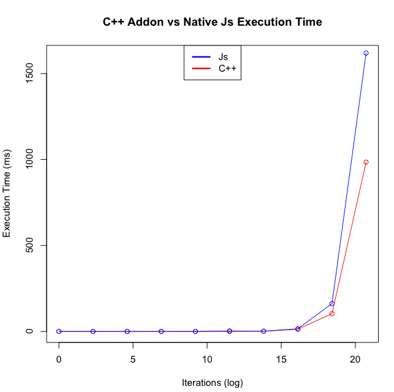

## An Example of How to use C++ Addons in Nodejs

### About

Since Nodejs is implemented using the V8 Javascript engine, which is written in C++, I wanted to now how I could interact with V8 directly, and if there would be any large performance benefits.

In this project I have implemented a simple floating point summation function using a C++ addon and native Nodejs.

### Summary

The data used to construct this graph is available in data.csv.




**build**

```bash
npm run-script build
```

**run**

```bash
npm start
```


